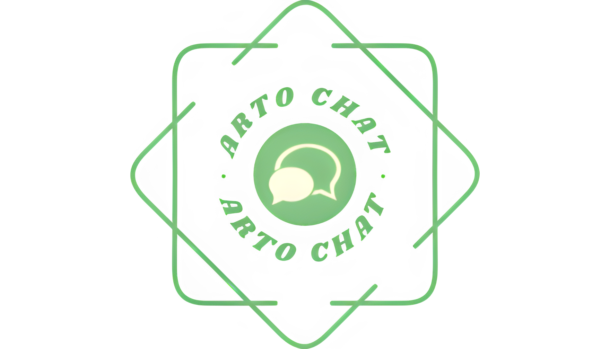

# ArtoChat Chatroom
## 3 Semester Chatroom projekt udarbejdet af Casper Hechmann, Nicklas Galver og Justin Chardonnay.

**ArtoChat Chatroom funktioner**  
ArtoChat Chatroom er opbygget ved hjælp af programmeringssproget Java for "Server" og "Client" og opmærkningssproget JavaFX for GUI.  
Chatrummet funktioner giver brugere mulighed for at vælge deres eget unikke navn, og tilslutte sig til et chatrum sammen med andre brugere, hvor de kan indsende tekstbeskeder til hinanden i reeltid.  

© 2023 Casper Emil Hechmann, Nicklas Flor Galver & Justin Xander Chardonnay. All Rights Reserved.
